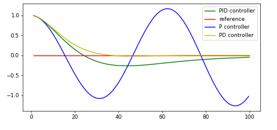

# CarND-Controls-PID
Self-Driving Car Engineer Nanodegree Program

---

## Dependencies

* cmake >= 3.5
 * All OSes: [click here for installation instructions](https://cmake.org/install/)
* make >= 4.1(mac, linux), 3.81(Windows)
  * Linux: make is installed by default on most Linux distros
  * Mac: [install Xcode command line tools to get make](https://developer.apple.com/xcode/features/)
  * Windows: [Click here for installation instructions](http://gnuwin32.sourceforge.net/packages/make.htm)
* gcc/g++ >= 5.4
  * Linux: gcc / g++ is installed by default on most Linux distros
  * Mac: same deal as make - [install Xcode command line tools]((https://developer.apple.com/xcode/features/)
  * Windows: recommend using [MinGW](http://www.mingw.org/)
* [uWebSockets](https://github.com/uWebSockets/uWebSockets)
  * Run either `./install-mac.sh` or `./install-ubuntu.sh`.
  * If you install from source, checkout to commit `e94b6e1`, i.e.
    ```
    git clone https://github.com/uWebSockets/uWebSockets 
    cd uWebSockets
    git checkout e94b6e1
    ```
    Some function signatures have changed in v0.14.x. See [this PR](https://github.com/udacity/CarND-MPC-Project/pull/3) for more details.
* Simulator. You can download these from the [project intro page](https://github.com/udacity/self-driving-car-sim/releases) in the classroom.

Fellow students have put together a guide to Windows set-up for the project [here](https://s3-us-west-1.amazonaws.com/udacity-selfdrivingcar/files/Kidnapped_Vehicle_Windows_Setup.pdf) if the environment you have set up for the Sensor Fusion projects does not work for this project. There's also an experimental patch for windows in this [PR](https://github.com/udacity/CarND-PID-Control-Project/pull/3).

## Basic Build Instructions

1. Clone this repo.
2. Make a build directory: `mkdir build && cd build`
3. Compile: `cmake .. && make`
4. Run it: `./pid`. 

Tips for setting up your environment can be found [here](https://classroom.udacity.com/nanodegrees/nd013/parts/40f38239-66b6-46ec-ae68-03afd8a601c8/modules/0949fca6-b379-42af-a919-ee50aa304e6a/lessons/f758c44c-5e40-4e01-93b5-1a82aa4e044f/concepts/23d376c7-0195-4276-bdf0-e02f1f3c665d)

## Editor Settings

We've purposefully kept editor configuration files out of this repo in order to
keep it as simple and environment agnostic as possible. However, we recommend
using the following settings:

* indent using spaces
* set tab width to 2 spaces (keeps the matrices in source code aligned)

## Code Style

Please (do your best to) stick to [Google's C++ style guide](https://google.github.io/styleguide/cppguide.html).

## Project Instructions and Rubric

Note: regardless of the changes you make, your project must be buildable using
cmake and make!

More information is only accessible by people who are already enrolled in Term 2
of CarND. If you are enrolled, see [the project page](https://classroom.udacity.com/nanodegrees/nd013/parts/40f38239-66b6-46ec-ae68-03afd8a601c8/modules/f1820894-8322-4bb3-81aa-b26b3c6dcbaf/lessons/e8235395-22dd-4b87-88e0-d108c5e5bbf4/concepts/6a4d8d42-6a04-4aa6-b284-1697c0fd6562)
for instructions and the project rubric.

## Hints!

* You don't have to follow this directory structure, but if you do, your work
  will span all of the .cpp files here. Keep an eye out for TODOs.

## Call for IDE Profiles Pull Requests

Help your fellow students!

We decided to create Makefiles with cmake to keep this project as platform
agnostic as possible. Similarly, we omitted IDE profiles in order to we ensure
that students don't feel pressured to use one IDE or another.

However! I'd love to help people get up and running with their IDEs of choice.
If you've created a profile for an IDE that you think other students would
appreciate, we'd love to have you add the requisite profile files and
instructions to ide_profiles/. For example if you wanted to add a VS Code
profile, you'd add:

* /ide_profiles/vscode/.vscode
* /ide_profiles/vscode/README.md

The README should explain what the profile does, how to take advantage of it,
and how to install it.

Frankly, I've never been involved in a project with multiple IDE profiles
before. I believe the best way to handle this would be to keep them out of the
repo root to avoid clutter. My expectation is that most profiles will include
instructions to copy files to a new location to get picked up by the IDE, but
that's just a guess.

One last note here: regardless of the IDE used, every submitted project must
still be compilable with cmake and make./

---

## Implementation

A **proportional–integral–derivative controller** (PID controller or three-term controller) is a control loop mechanism employing feedback that is widely used in industrial control systems and a variety of other applications requiring continuously modulated control. A PID controller continuously calculates an *error value e(t)* as the difference between a desired setpoint (SP) and a measured process variable (PV) and applies a correction based on proportional, integral, and derivative terms (denoted P, I, and D respectively), hence the name. Here is a image that shows the effect of different controllers on the cross track error value.




Here is a [Wikipedia](https://en.wikipedia.org/wiki/PID_controller) article for more information on the PID Controller.

In this project, we use the PID controller to steer the car as it moves around the track so that it stays in the center of the road. The PID controller is mainly implemented in the PID.cpp file. There are three *Init()*, *UpdateError()*, *TotalError()* functions defined within the 

1. We use the *Init()* function within class PID for initializing the values of Kp, Ki and Kd, the coefficients for the proportional, integral and differential terms.

2. The *UpdateError()* function is used to calculate and update the *cross track error* value on every iteration. This function accepts the calcualted cte value and updates the proportional, differential and integral error terms. Here is the code for the *UpdateError()* function:

```C++
void PID::UpdateError(double cte)
{
  // Update PID errors based on cte.
  d_error = cte-p_error;
  p_error = cte;
  i_error += cte;

  iter++;
}
```

3. The *TotalError()* function combines the individual terms to calculate the total error.

```C++
double PID::TotalError()
{
  // Calculate and return the total error
  double error = (-Kp * p_error) - (Kd * d_error) - (Ki * i_error);
  return error;
}
```
---
## Tuning the parameters

Setting up the correct hyperparameters for the proportional, differential and integral coefficients is very important for effectively controlling the trajectory (steering) of the vehicle.

The way this can be achieved is through the use of algorithms like Twiddle, Stochastic Gradient Descent (SGD) or by manual tuning. Changing the values of different coefficients have different effects on the vehicle steering behavior.

We start by setting all the hyperparameters to 0.0. With all the parameters set to 0, the vehicle keeps moving in a straight line and no steering is applied thereby continuosly increasing the cross track error.

### Proportional -

This parameter sets the control input. Since, this factor is proportional to the CTE, setting a high value will result in higher control inputs and will cause the vehicle to behave aggresively on every turn. if the error is large and positive, the control output will be proportionately large and positive, taking into account the gain factor "Kp".

We will start by increasing the proportional coefficient slowly. I increased the proportional coefficient slowly by about 0.2 (used a fine tuning of 0.05). I increased the ***Kp*** value till I got a steady oscillating vehicle (A vehicle which oscillates but does not go off the track.)

### Differential -

Then, I started increasing the d value. I found that increasing the ***Kd*** value takes care of the oscillations. I started increasing the value in the steps of 0.1 and found the oscillations to stabilize around a value of 0.75 for a throttle value of 0.3. The PID controller seems to be working perfectly at a value of 0.9-1.0 for ***Kd***.

### Integral -

The integral component collects the error over time and gives the accumulated offset that should have been corrected previously. Addition of this term reduces the steady state error. This gain compensates the bias in the system, thereby increasing the control signal.


These are the steps I took to come up with the parameters -

1. Setting all the parameters to zero. This way, the car will keep going straight without making any turns.

2. Increase the proportionality constant *Kp* in the steps of 0.1 till the oscillations are steady.

3. Increase the integral constant *Ki* in small steps to reduce the steady state error. We will set very small values for this gain.

4. Increase the differential constant *Kd* in the steps of 0.1 until the oscillations reduce.


These are the final values I came up with for the PID controller for different throttle setting values of 0.3, 0.4 and 0.5. (For higher throttle values, I was able to reach higher speeds.) -

| Gain Constant | Kp | Ki | Kd | Max Speed (mph)| Recorded Video link |
| :---: | :---: | :---: | :---: | :---: | :--- |
| 0.3 | 0.1 | 0.001 | 1.0 | 34.3 | [PID_control_0.3.mp4](./PID_Control_0.3.mp4)
| 0.4 | 0.135 | 0.001 | 1.5 | 44.2 | [PID_Control_0.4_throttle.mp4](./PID_Control_0.4.mp4)
| 0.5 | 0.135 | 0.0015 | 1.8 | 48.2 | [PID_Control_0.5_throttle.mp4](./PID_Control_0.5.mp4)


With these settings, I was able to reach a maximum speed of 48.2 mph. With a throttle setting of 0.5, the vehicle still oscillates a little but mostly stays on the track.

---

## Future Scope for Improvements

* As part of of further developments, we can also create a separate PID controller for throttle and speed.
* We can also implement algorithms such as SGD (Stochastic Gradient Descent) or Twiddle to tune the parameters.